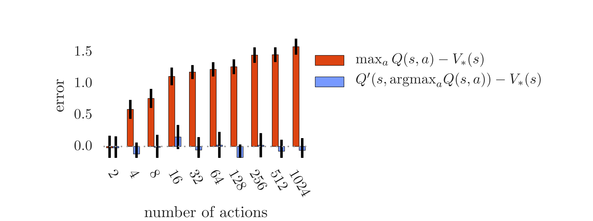

# Deep Reinforcement Learning with Double Q-learning

**Authors**: [DeepMind] Hado van Hasselt, Arthur Guez, David Silver

**Year**: 2015

**Algorithm**: **Double DQN**

**Links:** [[arxiv](https://arxiv.org/abs/1509.06461)]

### Highlights

- **Action value overestimation in Deep Q-learning**
- **Double Q-learning**

### Prerequisite

- DQN algorithm [[paper](https://www.cs.toronto.edu/~vmnih/docs/dqn.pdf)] [[summary](https://github.com/RPC2/DRL_paper_summary/blob/master/01%20Model-Free%20RL/001%20Playing%20Atari%20with%20Deep%20Reinforcement%20Learning.md)]

### Problems to solve

- Q-learning algorithm is known to overestimate action values under certain conditions.
- Overestimation of action values causes instabilities.

### Q-learning & Double Q-learning

- **Q-learning**
  - 
- **Double Q-learning**: two value functions are learned by assigning each experience randomly to update one of the two value functions. One is used to determine the greedy policy and the other to determine its value.
  - 

### Overoptimism due to estimation errors

- Estimation errors of any kind can induce an upward bias, regardless of whether these errors are due to environmental noise, function approximation, non-stationarity, or any other source.
- **Theorem**: 
  - For Q-Learning, under the condition that (arbitrary value estimates are unbiased), but that, then we have. This lower bound is tight. 
  - Under the same conditions, **the lower bound on the absolute error of Double Q-learning estimate is zero**.
- For Q-Learning, the overoptimism increases with the number of actions, but Double Q-learning is unbiased.
  - 

### Method

- Double DQN
  - The idea of Double Q-learning is to reduce overestimations by decomposing the **max** operation in the target into action selection and action evaluation. The paper proposed to evaluate the greedy policy according to the **online network** (), but using the **target network** () to estimate its value.
    - 
  - Empirical results show that double Q-learning can be used at scale to successfully reduce overoptimism, resulting in more stable and reliable learning.
