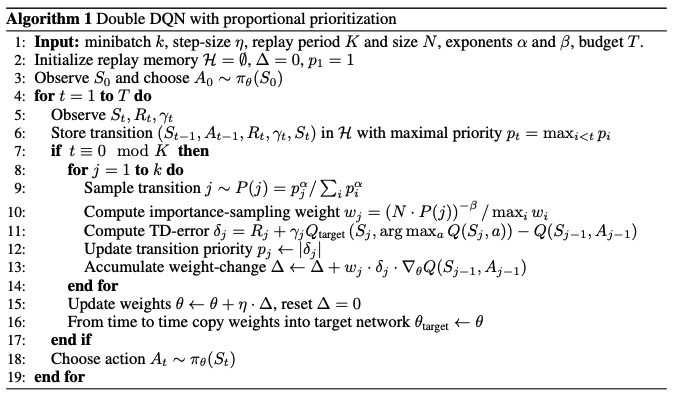

# Prioritized Experience Replay

**Authors**: Tom Schaul, John Quan, Ioannis Antonoglou, David Silver

**Year**: 2015

**Algorithm**: Prioritized Experience Replay (PER)

**Link**: [[arxiv](https://arxiv.org/abs/1511.05952)]

### Highlight

- **Prioritized experience replay with TD-errors**
- **Diversify sampling with stochastic prioritization**
- **Annealing the bias with importance sampling weights**

### Prerequisites

- DQN algorithm [[paper](https://www.cs.toronto.edu/~vmnih/docs/dqn.pdf)] [[summary](https://github.com/RPC2/DRL_paper_summary/blob/master/01%20Model-Free%20RL/001%20Playing%20Atari%20with%20Deep%20Reinforcement%20Learning.md)]

### Main Contribution

- This paper proposes a method to sample memories of higher significance (i.e., memories an agent can get more meaningful gradient updates) from DQN's replay buffer instead of sampling them uniformly.

### Methods

- **Assumption**: An RL agent can learn more effectively from some particular transitions than from others.
- A transition's **TD error** can be used to measure the priority of each transition, since it shows how 'surprising' or unexpected the transition is, which may be a good proxy. 

- **Greedy TD-error prioritization**
  - Greedy prioritization selects memories with the highest TD-error for every update.
  - Implementation: use a binary heap data structure for the priority queue.
  - Problems: 
    - Transitions with a low TD error on first visit may not be replayed for a long time. 
    - It is sensitive to noise spikes. i.e., It can fail easily when there are approximation errors which bring noises. 
    - Greedy prioritization focuses on only a subset of the experience that has high errors: errors shrink slowly => the initially high error transitions get replayed frequently.
  - In the implementation, a priority queue (a [data structure](https://en.wikipedia.org/wiki/Priority_queue)) is used to store the memories. It enables finding the maximum priority transition with  time complexity, and update the priorities .

- **Stochastic Prioritization**
  - To overcome the issues from greedy prioritization, a stochastic sampling method is proposed
    
  - The probability of sampling transition  is , where 0" /> is the priority of transition .  determines how much prioritization is used, with  corresponding to the uniform case.
    - Two variants for expressing :
      - **Proportional prioritization** variant is 
      - **Rank-based prioritization** variant is , where  is the rank of transition  when the replay memory is sorted according to . 
      - The latter is likely to be more robust since it is sensitive to outliers.
  - **Implementation**:
    - Rank-based prioritization — approximate the cumulative density function with a piecewise linear function with  segments of equal probability. Sample one transition from each segment.
    - Proportional prioritization — use a "sum-tree" data structure for implementation.

- **Annealing the bias**
  - Estimating the expected value with stochastic updates requires those updates are with the same distribution as its expectation. Prioritized replay introduces bias, but it can be corrected by: 
  - **Importance-Sampling (IS) weights**:, that fully corrects the non-uniform probability  if .
  - These weights can be integrated into the Q-learning update by using . To stablize the learning process, the weights are normalized by .  In practice, we linearly anneal  from its initial value  to 1.

- **Algorithm**

  

