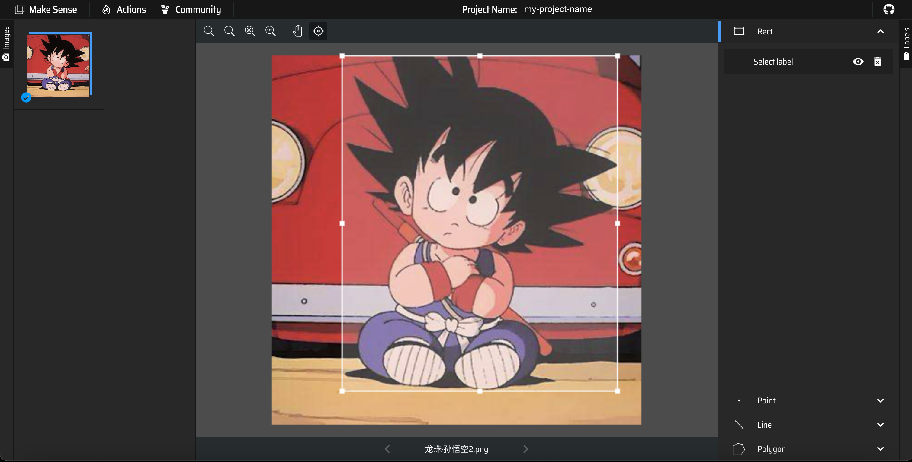

# awesome-image-augmentation

## 目录

- [相关论文](#相关论文)
- [标注工具](#标注工具)

## 相关论文

| 方法             | 来源                  | 论文                                                         | Github                                            |
| ---------------- | --------------------- | ------------------------------------------------------------ | ------------------------------------------------- |
| Cutout           | arXiv2017             | [Improved Regularization of Convolutional Neural Networks with Cutout](https://arxiv.org/abs/1708.04552) | https://github.com/uoguelph-mlrg/Cutout           |
| Mixup            | ICLR 2018             | [Mixup: Beyond Empirical Risk Minimization](https://arxiv.org/abs/1710.09412) | https://github.com/facebookresearch/mixup-cifar10 |
| CutMix           | ICCV 2019 (oral talk) | [CutMix:Regularization Strategy to Train Strong Classifiers with Localizable Features](https://arxiv.org/pdf/1905.04899.pdf) | https://github.com/clovaai/CutMix-PyTorch         |
| ImageCorruptions | arXiv 2019            | [Benchmarking Robustness in Object Detection:Autonomous Driving when Winter is Coming](https://arxiv.org/abs/1807.01697) | https://github.com/CrazyVertigo/imagecorruptions  |
| Random Erasing   | AAAI 2020             | [Random Erasing Data Augmentation](https://arxiv.org/pdf/1708.04896.pdf) | https://github.com/zhunzhong07/Random-Erasing     |
| GridMask         | arXiv 2020            | [Grid Mask Data Augmentation](https://arxiv.org/abs/2001.04086) | https://github.com/akuxcw/GridMask                |
| CycleGAN         | ICCV 2017             | [Unpaired Image-to-Image Translation using Cycle-Consistent Adversarial Networkss](https://arxiv.org/pdf/1912.02781.pdf) | https://github.com/junyanz/CycleGAN               |

## 标注工具

| 工具名称  | 网址                                                         | 工具界面                                       |
| --------- | ------------------------------------------------------------ | ---------------------------------------------- |
| LabelImg  | [https://github.com/HumanSignal/labelImg](https://github.com/HumanSignal/labelImg) |   |
| LabelMe   | [https://github.com/labelmeai/labelme](https://github.com/labelmeai/labelme) |    |
| MakeSense | https://www.makesense.ai/                                    |  |

